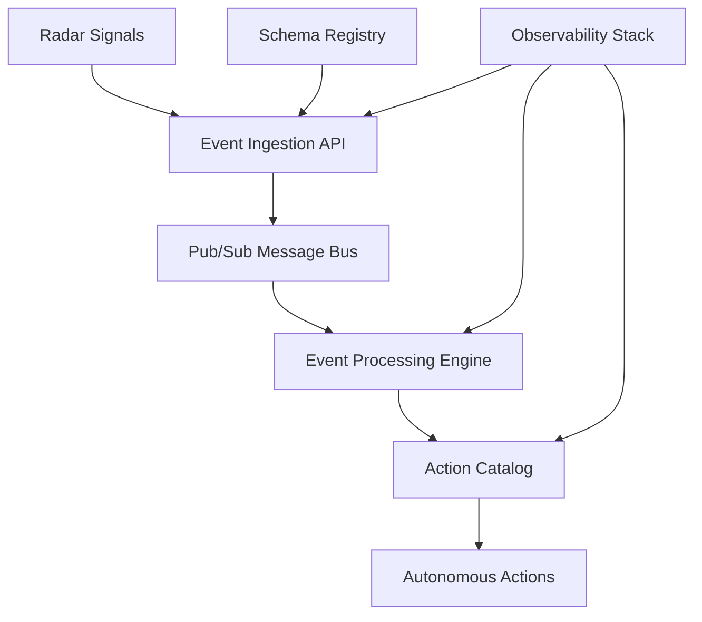

# Unified Data Intelligence Platform

> **A comprehensive system for ingesting, processing, and acting upon real-time data signals with intelligence and contextual awareness**

## 🏛️ Constitutional Foundation

This platform is built upon [Five Constitutional Principles](./CONSTITUTION.md) that ensure consistency, scalability, and maintainability:

1. **🔒 Strict Data Governance** - Canonical event schema adherence
2. **⚡ Scalable, Real-Time Architecture** - Serverless, event-driven design  
3. **👀 High Observability** - Comprehensive tracing and monitoring
4. **🔧 Modular and Reusable Design** - Action catalog with decoupled services
5. **🚀 Phased Evolution** - Strategic roadmap from MVP to AI autonomy

## 🏗️ Architecture Overview



## 🚀 Current Status

**Phase 1 - MVP**: Event Ingestion Foundation
- ✅ Event Ingestion API (Go + Cloud Functions)
- ✅ Canonical RadarSignal schema
- ✅ Pub/Sub message routing
- 🔄 Basic rule-based triggers (in development)

## 📁 Repository Structure

```
/
├── CONSTITUTION.md              # Constitutional principles (quick reference)
├── .specify/memory/constitution.md  # Full constitutional implementation
├── event-ingestion-api/        # Phase 1: Serverless event ingestion
├── action-catalog/             # Phase 2: Reusable action components (planned)
├── intelligence-engine/        # Phase 3: ML-driven pattern detection (planned)
└── autonomous-actions/         # Phase 4: Context-aware AI actions (planned)
```

## 🛠️ Development

All development must adhere to our [Constitutional Principles](./CONSTITUTION.md). Key requirements:

- **Schema Governance**: All events must conform to the canonical `RadarSignal` model
- **Serverless First**: Use Cloud Functions/Lambda for compute workloads
- **Observability**: Implement structured logging and distributed tracing
- **Testing**: Maintain 80%+ code coverage with contract testing
- **Documentation**: API-first development with OpenAPI specifications

## 📖 Documentation

- **[Constitution](./CONSTITUTION.md)** - Foundational principles and standards
- **[Event Ingestion API](./event-ingestion-api/README.md)** - Current Phase 1 implementation
- **[Architecture Decisions](./docs/adr/)** - Technical decision records
- **[API Documentation](./docs/api/)** - OpenAPI specifications

## 🤝 Contributing

1. Review the [Constitution](./CONSTITUTION.md) and ensure compliance
2. Follow the established [development standards](./.specify/memory/constitution.md#development-standards)
3. Submit architectural decisions for review before major changes
4. Maintain test coverage and documentation standards

---

**Platform Version**: 1.1.0 | **Constitution Version**: 1.1.0 | **Last Updated**: September 28, 2025
