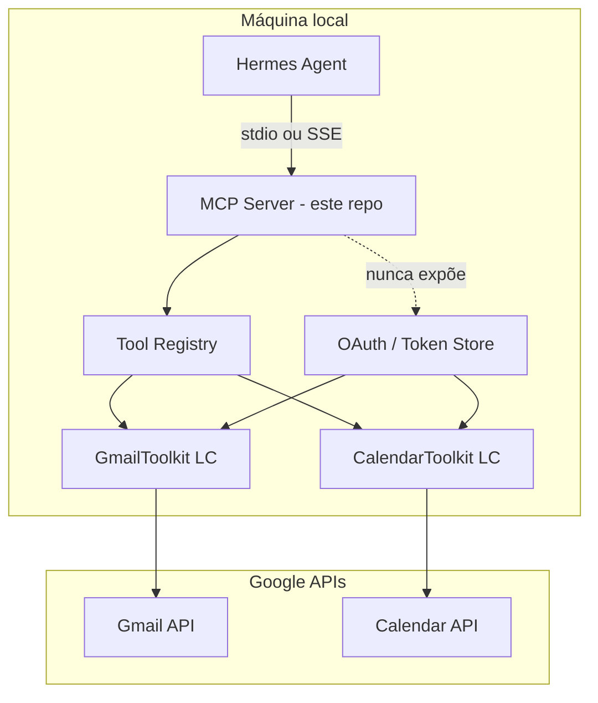

# Plano: Integrador LangChain para Hermes (OAuth + ferramentas locais)

**Versão:** 1.0 (implementado — Fase 1)  
**Branch:** `cursor/langchain-hermes-integrator-86e5`  
**Status:** MVP implementado; validação manual com Google OAuth pendente

---

## 1. Objetivo

Construir uma solução **local** que:

1. **Centralize** a conexão das suas contas (OAuth) às ferramentas que o agente usará.
2. **Reutilize** os toolkits oficiais do LangChain para **Gmail** e **Google Calendar**, incluindo o fluxo OAuth que eles já implementam (`get_google_credentials` / `InstalledAppFlow`).
3. **Exponha** essas capacidades ao agente **Hermes** de forma segura, preferencialmente via **MCP** (Model Context Protocol), sem colocar tokens ou `credentials.json` no contexto do LLM.
4. Permita **estender** no futuro outras integrações OAuth (Slack, Notion, GitHub, etc.) no mesmo padrão.

Hermes não precisa “saber LangChain”: ele só precisa de um **servidor MCP** estável com ferramentas bem definidas e credenciais resolvidas **fora** da sessão de chat.

---

## 2. O que foi estudado (LangChain + Hermes)

### 2.1 Gmail (`langchain-google-community[gmail]`)

- Pacote: `langchain-google-community` com extra `gmail`.
- Classe: `GmailToolkit` — ferramentas: rascunho, envio, busca, leitura de mensagem/thread.
- Auth padrão: lê `credentials.json` (Google Cloud OAuth client) e `token.json` (tokens do usuário).
- Auth customizada: `get_gmail_credentials()` → `build_resource_service()` → `GmailToolkit(api_resource=...)`.
- **Aviso de segurança** na documentação: ferramentas podem ler e **modificar** estado (enviar e-mail, etc.).

Documentação: https://docs.langchain.com/oss/python/integrations/tools/google_gmail

### 2.2 Google Calendar (`langchain-google-community[calendar]`)

- Mesmo pacote, extra `calendar`.
- Classe: `CalendarToolkit` — criar/buscar/atualizar/mover/apagar eventos, listar calendários, datetime atual.
- Auth: `get_google_credentials()` + `build_resource_service()` (calendar API).
- Scopes configuráveis (ex.: `calendar.readonly` vs `calendar` completo).

Documentação: https://docs.langchain.com/oss/python/integrations/tools/google_calendar

### 2.3 Como o LangChain faz OAuth (importante para o desenho)

Implementação em `langchain_google_community._utils.get_google_credentials`:

| Etapa | Comportamento |
|-------|----------------|
| 1 | Se existe `token.json` → carrega `Credentials` com os scopes pedidos |
| 2 | Se token expirado mas há `refresh_token` → `creds.refresh(Request())` |
| 3 | Senão → `InstalledAppFlow.from_client_secrets_file(...).run_local_server(port=0)` (navegador local) |
| 4 | Persiste novo token em `token.json` |

Isso é o fluxo **OAuth desktop** do Google (adequado para uso **local**, uma conta por máquina/usuário). **Não** é multi-usuário web out-of-the-box; para várias contas seria preciso evoluir o armazenamento de tokens (ver §6).

### 2.4 Hermes e MCP

- Hermes consome ferramentas via MCP; configuração típica em `~/.hermes/config.yaml`.
- Servidor MCP local (stdio ou HTTP/SSE): Hermes descobre tools no handshake e as usa nas sessões.
- LangGraph também pode expor agentes como MCP (`/mcp`), mas para o seu caso o desenho mais simples é: **este repo = servidor MCP fino** que delega para tools LangChain já autenticadas.

Referência Hermes: https://dev.to/emmanuelthecoder/hermes-the-self-improving-agent-you-can-actually-run-yourself-555l

---

## 3. Princípios de arquitetura



| Princípio | Descrição |
|-----------|-----------|
| **Separação auth / agente** | OAuth e refresh rodam no integrador; Hermes só chama tools MCP |
| **Menor privilégio** | Scopes mínimos por toolkit (readonly onde possível) |
| **Fail closed** | Sem token válido → tool retorna erro claro; agente não “inventa” acesso |
| **Um integrador, N providers** | Interface comum `ToolProvider` + implementações Google agora, outras depois |
| **Local-first** | `localhost`, dados em `data/` ignorado pelo git |

---

## 4. Arquitetura proposta (componentes)

### 4.1 Estrutura de diretórios (quando implementar)

```
integrator/
  __init__.py
  config.py              # paths, scopes, portas
  auth/
    google_oauth.py      # wrapper fino em get_google_credentials
    token_store.py       # paths por conta/provider
  providers/
    google_gmail.py      # GmailToolkit + metadados MCP
    google_calendar.py   # CalendarToolkit + metadados MCP
  mcp/
    server.py            # list_tools / call_tool
    schemas.py           # JSON Schema exposto ao Hermes
  cli/
    auth_login.py        # comando: conectar Gmail/Calendar
    serve.py             # subir servidor MCP
docs/
  PLANO_LANGCHAIN_HERMES.md
credentials/             # .gitignore — credentials.json do Google Cloud
data/tokens/             # .gitignore — token.json por provider
pyproject.toml
```

### 4.2 Servidor MCP (interface para Hermes)

**Transporte recomendado:** `stdio` para simplicidade com Hermes (`command` + `args` no `config.yaml`).

Cada tool LangChain vira uma tool MCP com:

- `name`: prefixo estável, ex. `google_gmail_search`, `google_calendar_create_event`
- `description`: copiada/adaptada da tool LC (para o modelo escolher bem)
- `inputSchema`: schema JSON derivado dos args da tool (Pydantic / introspection)

**Wrapper de execução:**

```text
Hermes call_tool(name, args)
  → validar args + rate limit opcional
  → resolver Credentials do provider
  → invocar BaseTool.invoke(args) do LangChain
  → sanitizar resposta (sem tokens, sem paths locais)
  → retornar texto/JSON ao Hermes
```

### 4.3 CLI de onboarding OAuth (antes do Hermes usar)

Comandos planejados:

```bash
# Abre navegador, grava token em data/tokens/gmail.json
python -m integrator.cli.auth_login --provider gmail

# Idem calendar (pode reutilizar mesmo OAuth client se scopes unificados)
python -m integrator.cli.auth_login --provider calendar

# Sobe MCP
python -m integrator.cli.serve
```

Exemplo `~/.hermes/config.yaml` (ilustrativo):

```yaml
mcp_servers:
  langchain-integrator:
    command: python
    args: ["-m", "integrator.cli.serve"]
    env:
      INTEGRATOR_ROOT: "/caminho/para/este/repo"
```

### 4.4 Scopes Google sugeridos (decisão de segurança)

| Provider | Scope conservador | Scope “agente produtivo” |
|----------|-------------------|-------------------------|
| Gmail | `gmail.readonly` | `https://mail.google.com/` (envio + rascunho) |
| Calendar | `calendar.readonly` | `https://www.googleapis.com/auth/calendar` |

**Recomendação inicial:** começar com **readonly** em desenvolvimento; promover scopes só quando fluxos estiverem validados.

### 4.5 Unificação OAuth Gmail + Calendar

Duas opções (decidir na implementação):

| Opção | Prós | Contras |
|-------|------|---------|
| **A – Um `token.json` com scopes unidos** | Um login; alinhado ao quickstart Google | Token único; revogação afeta os dois |
| **B – Tokens separados por provider** | Menor blast radius | Dois logins se scopes diferirem |

LangChain por padrão usa o mesmo `credentials.json` + `token.json` no CWD; o integrador deve **fixar paths** em `data/tokens/` para não depender do diretório de execução.

---

## 5. Segurança e proteção

### 5.1 O que NÃO vai para o Hermes / LLM

- `credentials.json`, `token.json`, refresh tokens
- Caminhos absolutos de secrets
- Corpo completo de e-mails com PII desnecessária (considerar truncar/redigir)

### 5.2 Controles recomendados

1. **Allowlist de tools** — config desliga envio de e-mail ou delete de eventos.
2. **Confirmação humana** (fase 2) — tools destrutivas (`send`, `delete`) exigem flag `confirm=true` ou fila pendente.
3. **Auditoria local** — log estruturado: tool, timestamp, sucesso/erro (sem conteúdo sensível).
4. **`.gitignore`** — já previsto para credenciais e `data/`.

### 5.3 Limitações do OAuth “LangChain desktop”

- Primeiro login abre **navegador na máquina** (`run_local_server`).
- Não é adequado para SaaS multi-tenant sem evoluir para OAuth web + PKCE + armazenamento por `user_id`.
- Para **só você**, local + Hermes: o modelo LangChain é **adequado**.

---

## 6. Extensão futura (outras contas OAuth)

Padrão repetível:

```text
OAuthProvider (interface)
  ├── google_gmail
  ├── google_calendar
  ├── slack (futuro)
  └── notion (futuro)

Cada um:
  - register_tools(registry)
  - get_credentials(user_key?) 
  - mcp_tool_definitions()
```

LangChain nem sempre tem toolkit oficial; onde não houver, usar `langchain_community` ou tools custom com o mesmo **TokenStore**.

---

## 7. Stack técnica sugerida

| Camada | Escolha | Motivo |
|--------|---------|--------|
| Linguagem | Python 3.11+ | Ecossistema LangChain/Google |
| LangChain | `langchain`, `langchain-core`, `langchain-google-community[gmail,calendar]` | Toolkits oficiais |
| MCP | `mcp` (SDK Python oficial) | Compatível com Hermes |
| Config | `pydantic-settings` + `.env` | Paths e flags sem hardcode |
| Empacotamento | `uv` ou `pip` + `pyproject.toml` | Reprodutível local |

**Opcional (não Fase 1):** LangSmith tracing, LangGraph se quiser grafos complexos; para “integrador de tools”, MCP + toolkits basta.

---

## 8. Fases de implementação

### Fase 0 — Preparação Google Cloud (manual, uma vez)

1. Projeto no [Google Cloud Console](https://console.cloud.google.com/).
2. Ativar **Gmail API** e **Google Calendar API**.
3. Criar credencial OAuth **Desktop app** → baixar `credentials.json` → `credentials/` (fora do git).
4. Adicionar seu e-mail como usuário de teste (app em modo Testing).

### Fase 1 — MVP local ✅

- [x] `pyproject.toml` + pacote `integrator`
- [x] Wrapper `google_oauth` com token unificado
- [x] CLI `python -m integrator.cli.auth_login`
- [x] `GmailToolkit` + `CalendarToolkit` — 12 tools
- [x] Servidor MCP stdio (`python -m integrator.cli.serve`)
- [x] `config/hermes.example.yaml` + testes `pytest`
- [ ] Validação manual com credenciais Google reais + Hermes

### Fase 2 — End shardening

- [ ] Allowlist / toggles por tool
- [ ] Confirmação para ações de escrita
- [ ] Logs de auditoria
- [ ] Tratamento de refresh errors + mensagem “rode auth_login”

### Fase 3 — Extensões

- [ ] Segundo provider OAuth (template)
- [ ] Transporte SSE/HTTP se Hermes rodar remoto
- [ ] Multi-conta (vários `token` em `data/tokens/{account_id}/`)

---

## 9. Decisões (fechadas)

| # | Pergunta | Decisão |
|---|----------|---------|
| 1 | Scopes | **Acesso completo** — `https://mail.google.com/` + `https://www.googleapis.com/auth/calendar` |
| 2 | Token | **Um único token** (`data/tokens/google.json`) — mais simples |
| 3 | Tools Hermes | **Todas** (12 tools Gmail + Calendar) |
| 4 | Hermes | **Sim**, mesma máquina → transporte MCP **stdio** |
| 5 | Linhagem LangChain | **Python** (Node não tem paridade nos toolkits Google Community) |
| 6 | LLM | Hermes usa o próprio modelo; integrador só expõe MCP + OAuth |

Atividades detalhadas: [`ATIVIDADES_IMPLANTACAO.md`](ATIVIDADES_IMPLANTACAO.md).

---

## 10. Riscos e mitigações

| Risco | Mitigação |
|-------|-----------|
| Agente envia e-mail indevido | Allowlist; confirmação humana; scope readonly no início |
| `token.json` vazado | `.gitignore`; permissões `chmod 600`; diretório `data/` |
| Deprecation `get_gmail_credentials` | Usar `get_google_credentials` diretamente (já unificado no código-fonte) |
| Tool schema incompatível com MCP | Testes de handshake; schemas manuais para tools problemáticas |
| OAuth Google “app não verificado” | Modo Testing + usuários de teste limitados |

---

## 11. Critérios de sucesso (aceite)

1. Após `auth_login`, existe token válido em `data/tokens/` sem commit no git.
2. `python -m integrator.cli.serve` sobe MCP e lista ≥1 tool Gmail e ≥1 tool Calendar.
3. Hermes, com entrada em `config.yaml`, vê as tools em `hermes tools` (ou equivalente).
4. Uma invocação real (ex.: buscar últimos e-mails / eventos de hoje) retorna dados coerentes.
5. Nenhum secret aparece na saída da tool nem nos logs padrão.

---

## 12. Resumo executivo

| Item | Decisão proposta |
|------|------------------|
| Papel do repo | Servidor MCP local = “integrador” de ferramentas OAuth |
| Gmail / Calendar | Toolkits `langchain-google-community` + OAuth via `get_google_credentials` |
| Hermes | Cliente MCP; config em `~/.hermes/config.yaml` |
| Onde fica o segredo | `credentials/` + `data/tokens/` local, fora do agente |
| Implementação | **Fase 1 concluída** em `integrator/` — ver README e ATIVIDADES |

---

## Referências

- [Gmail toolkit (LangChain)](https://docs.langchain.com/oss/python/integrations/tools/google_gmail)
- [Google Calendar toolkit (LangChain)](https://docs.langchain.com/oss/python/integrations/tools/google_calendar)
- [langchain-google — `_utils.get_google_credentials`](https://github.com/langchain-ai/langchain-google/blob/main/libs/community/langchain_google_community/_utils.py)
- [Hermes + MCP](https://dev.to/emmanuelthecoder/hermes-the-self-improving-agent-you-can-actually-run-yourself-555l)
- [MCP endpoint LangGraph / Agent Server](https://docs.langchain.com/langsmith/server-mcp) (referência se no futuro usar LangGraph em vez de MCP custom)
