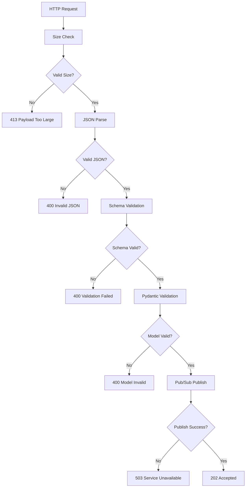
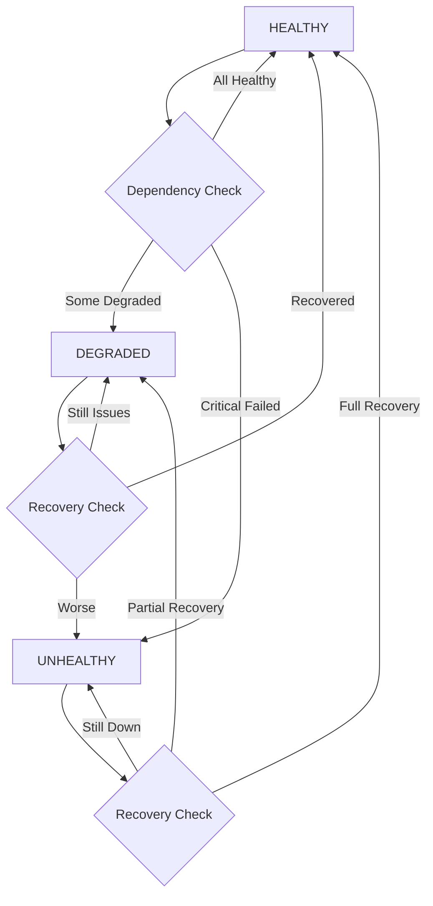

# Data Model Design: Radar Signals Event Ingestion API

**Feature**: Radar Signals Event Ingestion API  
**Date**: September 28, 2025  
**Based on**: Specification requirements and research findings

## Core Entities

### 1. RadarSignalEvent (Input Model)

**Purpose**: Canonical business event format for platform ingestion

**Pydantic Model Definition**:
```python
from pydantic import BaseModel, Field, UUID4, validator
from typing import Dict, Any, Optional
from datetime import datetime
from enum import Enum
import re

class RadarSignalEvent(BaseModel):
    """
    Canonical radar signal event model enforcing strict data governance.
    Validates against the constitutional requirement for schema compliance.
    """
    
    event_id: UUID4 = Field(
        ..., 
        description="Unique identifier for the specific event occurrence (UUID v4)",
        example="123e4567-e89b-42d3-a456-426614174000"
    )
    
    event_timestamp: datetime = Field(
        ...,
        description="ISO 8601 timestamp when the business event occurred",
        example="2025-09-28T14:30:00.000Z"
    )
    
    event_source: str = Field(
        ...,
        min_length=1,
        max_length=100,
        description="System or service that generated the event",
        regex=r"^[a-zA-Z0-9][a-zA-Z0-9-_.]*[a-zA-Z0-9]$",
        example="user-management-service"
    )
    
    event_type: str = Field(
        ...,
        min_length=1,
        max_length=200,
        description="Hierarchical event classification (domain.entity.action)",
        regex=r"^[a-zA-Z][a-zA-Z0-9-]*\.[a-zA-Z][a-zA-Z0-9-]*\.[a-zA-Z][a-zA-Z0-9-]*$",
        example="user.signup.completed"
    )
    
    event_version: str = Field(
        ...,
        description="Semantic version of the event schema",
        regex=r"^\d+\.\d+\.\d+$",
        example="1.0.0"
    )
    
    payload: Dict[str, Any] = Field(
        ...,
        min_items=1,
        max_items=50,
        description="Business-specific event data conforming to event type schema"
    )
    
    class Config:
        # Pydantic v2 configuration
        json_schema_extra = {
            "examples": [
                {
                    "event_id": "123e4567-e89b-42d3-a456-426614174000",
                    "event_timestamp": "2025-09-28T14:30:00.000Z",
                    "event_source": "user-management-service",
                    "event_type": "user.signup.completed",
                    "event_version": "1.0.0",
                    "payload": {
                        "user_id": "usr_789",
                        "email": "user@example.com",
                        "subscription": "premium"
                    }
                }
            ]
        }
    
    @validator('event_timestamp')
    def validate_timestamp_format(cls, v):
        """Ensure timestamp is in UTC and properly formatted."""
        if v.tzinfo is None:
            raise ValueError('Timestamp must include timezone information')
        return v
    
    @validator('payload')
    def validate_payload_size(cls, v):
        """Ensure payload doesn't exceed reasonable size limits."""
        import json
        payload_size = len(json.dumps(v).encode('utf-8'))
        if payload_size > 1048576:  # 1MB limit
            raise ValueError(f'Payload size {payload_size} bytes exceeds 1MB limit')
        return v
```

### 2. ValidationError (Error Detail Model)

**Purpose**: Structured validation error information for client debugging

**Pydantic Model Definition**:
```python
class ValidationError(BaseModel):
    """
    Individual field validation error with specific failure details.
    Supports constitutional requirement for high observability.
    """
    
    field: str = Field(
        ...,
        description="JSON path to the field that failed validation",
        example="event_timestamp"
    )
    
    message: str = Field(
        ...,
        description="Human-readable validation error message",
        example="Invalid ISO 8601 timestamp format"
    )
    
    code: Optional[str] = Field(
        None,
        description="Machine-readable error code for automated handling",
        example="INVALID_FORMAT"
    )
    
    expected_format: Optional[str] = Field(
        None,
        description="Expected format or pattern for the field",
        example="YYYY-MM-DDTHH:MM:SS.sssZ"
    )
```

### 3. EventAcceptedResponse (Success Response Model)

**Purpose**: Standardized success response for accepted events

**Pydantic Model Definition**:
```python
class EventAcceptedResponse(BaseModel):
    """
    Success response confirming event acceptance and queuing.
    Includes tracing information for end-to-end observability.
    """
    
    status: str = Field(
        default="accepted",
        description="Confirmation status - always 'accepted' for successful ingestion"
    )
    
    event_id: UUID4 = Field(
        ...,
        description="Echo of submitted event ID for correlation"
    )
    
    trace_id: str = Field(
        ...,
        description="Unique trace identifier for request tracking",
        example="trace_abc123def456ghi789"
    )
    
    timestamp: datetime = Field(
        default_factory=datetime.utcnow,
        description="Server timestamp when response was generated"
    )
    
    message_id: Optional[str] = Field(
        None,
        description="Pub/Sub message ID for downstream tracking",
        example="1234567890123456"
    )
```

### 4. ErrorResponse (Error Response Model)

**Purpose**: Standardized error response with detailed failure information

**Pydantic Model Definition**:
```python
class ErrorType(str, Enum):
    """Error type enumeration for consistent error classification."""
    VALIDATION_FAILED = "VALIDATION_FAILED"
    PAYLOAD_TOO_LARGE = "PAYLOAD_TOO_LARGE"  
    RATE_LIMIT_EXCEEDED = "RATE_LIMIT_EXCEEDED"
    SERVICE_UNAVAILABLE = "SERVICE_UNAVAILABLE"
    INTERNAL_SERVER_ERROR = "INTERNAL_SERVER_ERROR"

class ErrorResponse(BaseModel):
    """
    Comprehensive error response supporting constitutional observability requirements.
    Provides actionable information for client retry logic.
    """
    
    error: ErrorType = Field(
        ...,
        description="Machine-readable error type classification"
    )
    
    message: str = Field(
        ...,
        description="Human-readable error summary",
        example="Event validation failed against canonical schema"
    )
    
    details: Optional[List[ValidationError]] = Field(
        None,
        description="Specific validation failure details (for VALIDATION_FAILED errors)"
    )
    
    trace_id: str = Field(
        ...,
        description="Unique trace identifier for error correlation"
    )
    
    timestamp: datetime = Field(
        default_factory=datetime.utcnow,
        description="Server timestamp when error occurred"
    )
    
    retryable: bool = Field(
        ...,
        description="Whether the client should retry this request"
    )
    
    retry_after: Optional[int] = Field(
        None,
        description="Seconds to wait before retrying (for rate limiting)"
    )
```

### 5. HealthStatus (Health Check Model)

**Purpose**: Service health and dependency status reporting

**Pydantic Model Definition**:
```python
class ServiceStatus(str, Enum):
    """Service health status enumeration."""
    HEALTHY = "healthy"
    DEGRADED = "degraded" 
    UNHEALTHY = "unhealthy"

class DependencyHealth(BaseModel):
    """Individual dependency health information."""
    status: ServiceStatus
    response_time_ms: Optional[float] = None
    last_check: datetime
    error_message: Optional[str] = None

class HealthMetrics(BaseModel):
    """Operational metrics for monitoring and alerting."""
    uptime_seconds: int
    requests_per_second: float
    average_latency_ms: float
    error_rate_percent: float
    total_events_processed: int
    events_processed_today: int

class HealthResponse(BaseModel):
    """
    Comprehensive health status supporting constitutional observability.
    Enables monitoring, alerting, and operational visibility.
    """
    
    status: ServiceStatus = Field(
        ...,
        description="Overall service health status"
    )
    
    timestamp: datetime = Field(
        default_factory=datetime.utcnow,
        description="Timestamp when health check was performed"  
    )
    
    version: str = Field(
        default="1.0.0",
        description="API version for debugging and compatibility"
    )
    
    dependencies: Dict[str, DependencyHealth] = Field(
        default_factory=dict,
        description="Health status of external dependencies"
    )
    
    metrics: HealthMetrics = Field(
        ...,
        description="Operational metrics and statistics"
    )
    
    issues: Optional[List[Dict[str, Any]]] = Field(
        None,
        description="Current issues affecting service health"
    )
```

## Data Validation Rules

### Schema Validation Strategy

**JSON Schema Validation**:
- Use pre-compiled jsonschema validators for performance (<2ms validation time)
- Enforce canonical schema compliance with zero tolerance for violations
- Validate against JSON Schema Draft 2020-12 for best error messages

**Pydantic Validation**:
- Runtime type checking and format validation
- Custom validators for business logic constraints
- Automatic serialization/deserialization with proper error handling

**Validation Hierarchy**:
1. **HTTP Level**: Content-Type, request size limits
2. **JSON Level**: Valid JSON syntax and structure  
3. **Schema Level**: jsonschema validation against canonical format
4. **Model Level**: Pydantic validation for additional business rules
5. **Business Level**: Custom validation for event type specific rules

### Error Handling Strategy

**Validation Pipeline**:
```python
class ValidationPipeline:
    """
    Multi-stage validation pipeline ensuring constitutional data governance.
    Each stage provides specific error details for client debugging.
    """
    
    def validate_request(self, raw_data: bytes) -> RadarSignalEvent:
        """Execute validation pipeline with detailed error reporting."""
        
        # Stage 1: JSON parsing
        try:
            json_data = json.loads(raw_data)
        except json.JSONDecodeError as e:
            raise ValidationError(
                field="request_body",
                message=f"Invalid JSON syntax: {e.msg}",
                code="INVALID_JSON"
            )
        
        # Stage 2: JSON Schema validation  
        try:
            self.json_schema_validator.validate(json_data)
        except jsonschema.ValidationError as e:
            raise ValidationError(
                field=e.json_path,
                message=e.message,
                code="SCHEMA_VIOLATION",
                expected_format=e.schema.get("format")
            )
        
        # Stage 3: Pydantic model validation
        try:
            return RadarSignalEvent(**json_data)
        except pydantic.ValidationError as e:
            validation_errors = []
            for error in e.errors():
                validation_errors.append(ValidationError(
                    field=".".join(str(loc) for loc in error["loc"]),
                    message=error["msg"],
                    code=error["type"]
                ))
            raise MultipleValidationError(errors=validation_errors)
```

## State Transitions

### Event Processing Flow



### Health Status Transitions



## Performance Considerations

### Memory Usage Optimization

**Model Memory Footprint**:
- RadarSignalEvent: ~1KB per instance (including payload)
- Validation errors: ~100-500 bytes per error
- Response models: ~200-500 bytes per response  
- Compiled validators: ~50MB one-time cost (cached globally)

**Optimization Strategies**:
- Use `__slots__` for high-frequency objects to reduce memory overhead
- Cache compiled validators globally to amortize initialization cost
- Lazy load validation rules to minimize cold start time
- Stream large payloads instead of loading entirely into memory

### Validation Performance

**Performance Targets**:
- JSON parsing: <0.5ms for typical 1-5KB events
- Schema validation: <2ms with pre-compiled validators
- Pydantic validation: <1ms for standard models
- Total validation time: <5ms per event (95th percentile)

**Monitoring Metrics**:
- Validation latency distribution (p50, p95, p99)
- Validation error rate by error type
- Memory usage per concurrent request
- Cache hit rate for compiled validators

---

**Data Model Status**: ✅ **Complete** - Ready for contract generation

*Models designed to enforce constitutional data governance while optimizing for serverless performance requirements*